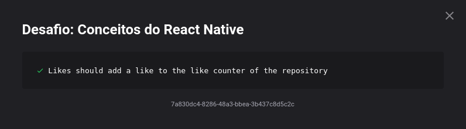

<h1 align="center">
  Desafio 04: Conceitos React Native
</h1>

<blockquote align="center">“Sucesso não é o resultado de um jogo, mas o destino de uma jornada”!</blockquote>

## Sobre o desafio 💪
Mais um desafio do GoStack 13.0! 🚀  
Agora aprendemos a usar o React Native sem precisar do Expo, ou seja, usamos react native do zero! 
No desafio usamos a nossa API criada no "desafio-conceitos-node" para listar os repositorios da API e ainda poder dar Likes neles.   
Com esse desafio se encerra os desafios de conceitos e partir da
próxima semana iremos nos aprofundar nas tecnologias NodeJS, ReactJS, React Native e também TypeScript. 🚀  
Foi usado o Jest (uma estrutura de testes criada pelo Facebook) para realizar os testes e ver se passamos no desafio, os testes eram os seguintes 🛠  
</img>
Para mais detalhes sobre o desafio e que era precisa ser feito para ser passado em cada teste, você pode ver neste <a href="https://github.com/rocketseat-education/bootcamp-gostack-desafios/tree/master/desafio-conceitos-react-native">link</a>.

## 1/1 Teste Concluído 🎯
Consegui passar no teste, e isso me garantiu uma nota 10.00 nesse desafio. 😀
</img>
